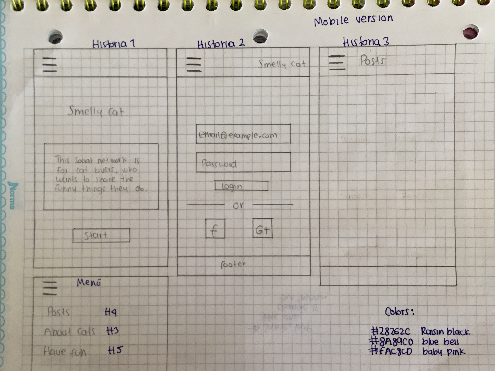
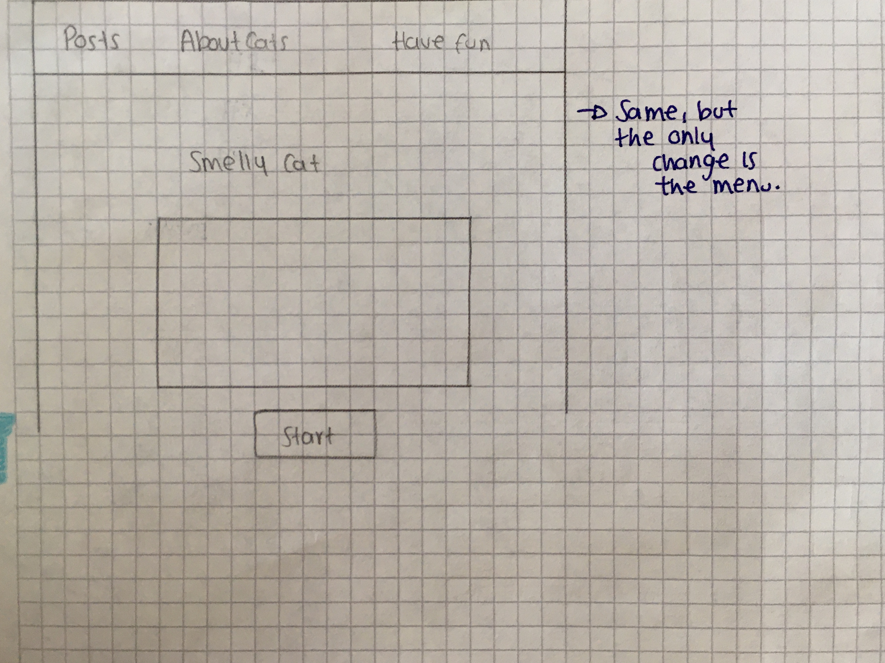
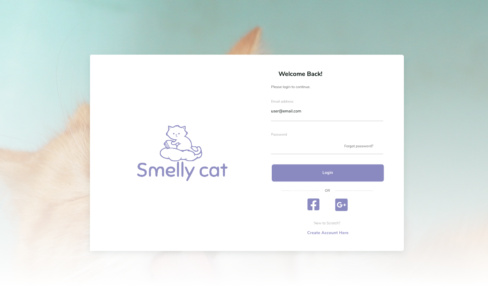
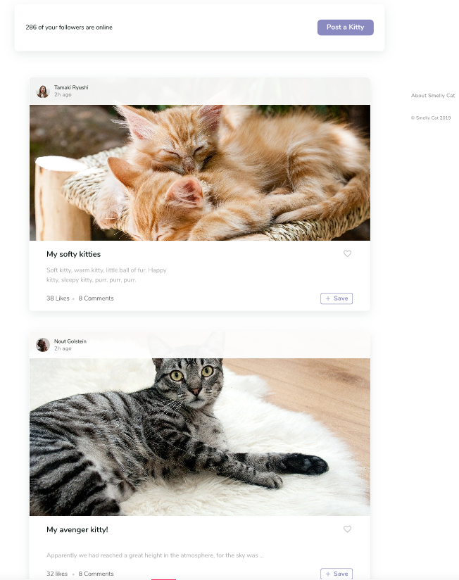
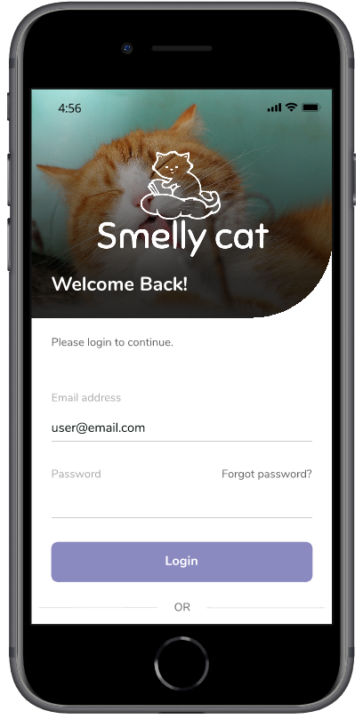
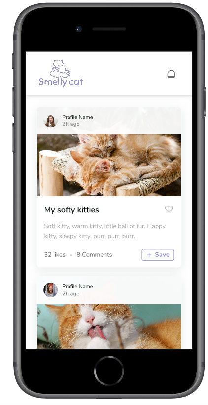

## SMELLY CAT 💜

### DEFINICIÓN DEL PRODUCTO

Este proyecto es una red social de gatos, que va a facilitar a los  usuarios y amantes de los gatos iniciar sesión para divertirse un rato, publicar cosas chistosas que hacen sus gatos diariamente, tener mas interacción con otros dueños de gatos. también hay una sección de adopciones que facilita al usuario saber los requerimientos para poder iniciar su proceso de adopción, luego encuentra un botón que lo redirige a otra pagina para llenar el formulario de adopción.

**************************************************************************
### OBJETIVOS DEL PROYECTO

Crear un sitio web agradable, que se adapte a todas las pantallas (Responsive) y fácil de entender enfocado a usuarios amantes de los gatos, que se puedan distraer un rato viendo lo que estas hermosas criaturas hacen.

*******************************************************************************************

### HISTORIAS DE USUARIO

* [x] Historia 1: Yo como usuario que va a usar esta red social, me gustaría ver primero la información acerca de la pagina para saber si quiero loguearme o no.
* [x] Historia 2: yo como usuario me gustaría poder loguearme por medio de redes sociales para evitar tener que registrarme como normalmente lo hago, ya que es un paso un poco tedioso.
* [x]  Historia 3: Yo como amante de los gatos, me gustaría tener una sección de adopción para que los gatitos puedan encontrar un hogar.
* [x] Historia 4: Yo como amante de los gatos, me gustaría poder publicar posts de mi gato para que la demás gente lo conozca.
* [x] Historia 5: Yo como amante de los gatos, me gustaría poder dar like y comentar en otras publicaciones para tener mayor interacción con los demás Cat lovers.
* [x] Historia 6: Yo como amante de los gatos, me gustaría tener una sección de memes para divertirme un rato y que la cuarentena sea mas amena.

************************************************************************************
### PROTOTIPOS DE ALTA Y BAJA FIDELIDAD

*Prototipos baja fidelidad*
***************************************************************

*Prototipos alta fidelidad*
**************************************************************
*Versión Desktop*

*Versión Movil*

*******************************************************************************************
### TESTS DE USABILIDAD

*Primer acercamiento a nuestra pagina*

 En los tests de usabilidad, se detecto que al principio la pagina no tenia muchos colores, entonces por sugerencia de nuestros usuarios se decidió implementar una imagen con linear gradient para darle un poco mas de color.
 Otra observación que nos hicieron, fue poner mas vistoso el botón de crear post, ya que no era tan visible a simple vista. Para ello se le puso otro color al botón que fuera diferente al footer para que no se confundiera.

*Como el usuario interactua  con la pagina*

 1. Cuando el  usuario decide entrar a nuestra red social, primero ve una sección de información acerca del contenido de la pagina, para que pueda decidir si iniciar sesión o no. 
2.  La primer sección con la que interactua es la de el login y el sing up, en esta sección el usuario tiene la opción de iniciar sesión o registrarse, dependiendo de si es la primera vez que el ingresa a la pagina.
3.  En el login tiene la opción de ingresar con Google, que es mucho mas rápido y ya habiendo entrado podrá ver todo el contenido que hay dentro. 
4.  Lo siguiente es que el usuario nota la sección de  posts y puede publicar cosas de su gato. Se da cuenta también, que puede interactuar con mas usuarios que publican cosas muy graciosas de sus gatos.
5.  Luego, hay una sección de adopciones, dedicada a los gatitos sin hogar, se encuentra con un formulario de requisitos para luego darle click al botón de llenar formulario que lo redirecciona a otra pagina con mas información y el formulario par iniciar con el proceso de adopción 

************************************************************

*¿Cómo ejecutar este proyecto?*

Solo necesitas un navegador y dar click en el siguiente link:

*****************
## OBJETIVOS DE APRENDIZAJE

### HTML y CSS

* [x] [Uso de HTML semántico.](https://developer.mozilla.org/en-US/docs/Glossary/Semantics#Semantics_in_HTML)
* [x] Uso de selectores de CSS.
* [x] Construir tu aplicación respetando el diseño realizado (maquetación).
* [x] [Uso de flexbox en CSS.](https://css-tricks.com/snippets/css/a-guide-to-flexbox/)

### DOM y Web APIs

* [x] Uso de selectores del DOM.
* [ ] Manejo de eventos del DOM.
* [x] [Manipulación dinámica del DOM.](https://developer.mozilla.org/es/docs/Referencia_DOM_de_Gecko/Introducci%C3%B3n)
(appendChild |createElement | createTextNode| innerHTML | textContent | etc.)
* [ ] [History API.](https://developer.mozilla.org/es/docs/DOM/Manipulando_el_historial_del_navegador)
* [ ] [localStorage.](https://developer.mozilla.org/es/docs/Web/API/Window/localStorage)

### JavaScript

* [x] Uso de condicionales (if-else | switch | operador ternario)
* [x] Uso de funciones (parámetros | argumentos | valor de retorno)
* [x] Manipular arrays (filter | map | sort | reduce)
* [x] Manipular objects (key | value)
* [x] Uso ES modules ([`import`](https://developer.mozilla.org/en-US/docs/Web/JavaScript/Reference/Statements/import)
| [`export`](https://developer.mozilla.org/en-US/docs/Web/JavaScript/Reference/Statements/export))
* [x] Diferenciar entre expression y statements.
* [ ] Diferenciar entre tipos de datos primitivos y no primitivos.
* [x] [Uso de callbacks.](https://developer.mozilla.org/es/docs/Glossary/Callback_function)
* [x] [Consumo de Promesas.](https://scotch.io/tutorials/javascript-promises-for-dummies#toc-consuming-promises)

### Testing

* [ ] [Testeo unitario.](https://jestjs.io/docs/es-ES/getting-started)
* [ ] [Testeo asíncrono.](https://jestjs.io/docs/es-ES/asynchronous)
* [ ] [Uso de librerias de Mock.](https://jestjs.io/docs/es-ES/manual-mocks)

### Estructura del código y guía de estilo

* [x] Organizar y dividir el código en módulos (Modularización)
* [x] Uso de identificadores descriptivos (Nomenclatura | Semántica)
* [x] Uso de linter (ESLINT)

### Git y Github

* [x] Uso de comandos de git (add | commit | pull | status | push)
* [x] Manejo de repositorios de GitHub (clone | fork | gh-pages)
* [x] Colaboración en Github (branches | pull requests | |tags)
* [ ] Organización en Github (projects | issues | labels | milestones)

### Firebase

* [x] [Firestore.](https://firebase.google.com/docs/firestore)
* [x] [Firebase Auth.](https://firebase.google.com/docs/auth/web/start)
* [x] [Firebase security rules.](https://firebase.google.com/docs/rules)
* [x] Observadores. ([onAuthStateChanged](https://firebase.google.com/docs/auth/web/manage-users?hl=es#get_the_currently_signed-in_user)
 | [onSnapshot](https://firebase.google.com/docs/firestore/query-data/listen#listen_to_multiple_documents_in_a_collection))

### UX

* [x] Diseñar la aplicación pensando y entendiendo al usuario.
* [x] Crear prototipos para obtener feedback e iterar.
* [x] Aplicar los principios de diseño visual (contraste, alineación, jerarquía)
* [x] Planear y ejecutar tests de usabilidad.
